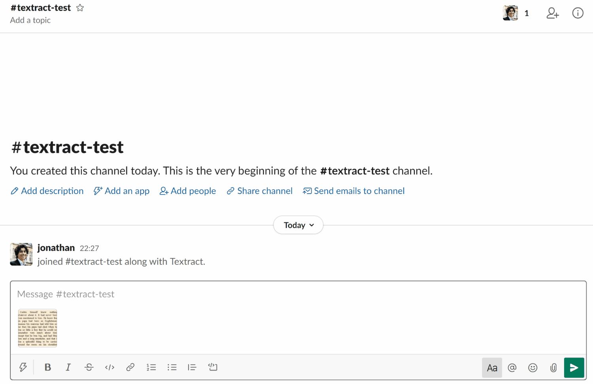

# SlackTextract

Extract text from images posted to Slack using Amazon Textract. The extracted
text is posted in a thread under the image and gets indexed!

## Installation

### 1. Create a Slack app

Create a new [Slack app](https://api.slack.com/apps) in your workspace, add the
`chat:write` and `files:read` bot scopes, install it and save its app id, bot token
and signing secret in a [AWS Secrets Manager](https://aws.amazon.com/secrets-manager/)
secret.

This can be done with the [AWS CLI](https://aws.amazon.com/cli/):

```
aws secretsmanager create-secret --name my-slack-app --secret-string '{"appId":"<id>","signingSecret":"<secret>","botToken":"<token>"}'
```

### 2. Add the SlackTextract construct

Define a `SlackTextract` in your `Stack` and deploy it:

```ts
import * as cdk from '@aws-cdk/core';
import * as cloudstructs from 'cloudstructs';

export class MyStack extends cdk.Stack {
  constructor(scope: cdk.Construct, id: string, props?: cdk.StackProps) {
    super(scope, id, props);

    new cloudstructs.SlackTextract(stack, 'SlackTextract', {
      signingSecret: cdk.SecretValue.secretsManager('my-slack-app', { jsonField: 'signingSecret' }),
      appId: cdk.SecretValue.secretsManager('my-slack-app', { jsonField: 'appId' }).toString(),
      botToken: cdk.SecretValue.secretsManager('my-slack-app', { jsonField: 'botToken' }),
    });
  }
}
```

### 3. Connect your Slack app to the deployed API

Look for the API endoint in your stack outputs and use it to enable event subscriptions
in your Slack app and subscribe to the `file_shared` events.

### 4. Add your app to a channel

Add your app to a channel, share an image and let the magic happen:

<p align="center">
  
</p>
